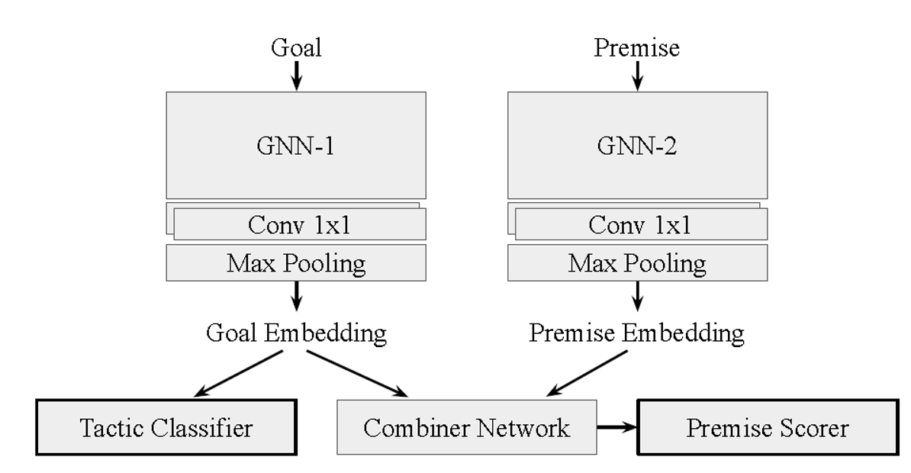
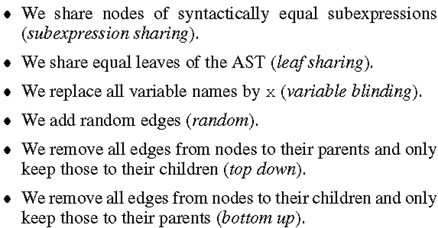
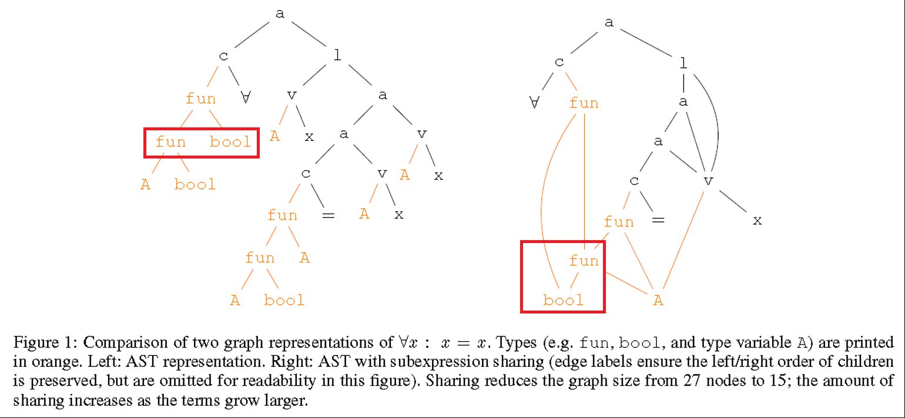
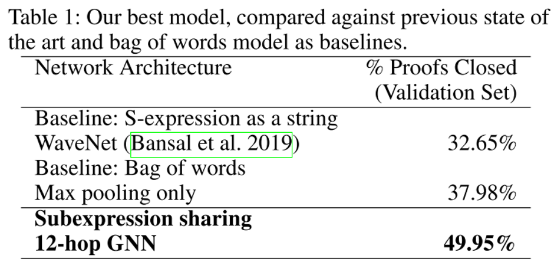
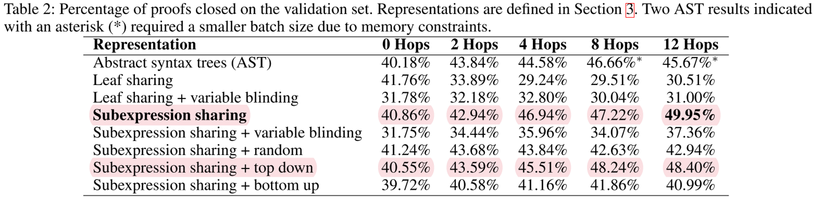

# Summary: Graph Representations for Higher-Order Logic and Theorem Proving (2020)

In this post, we discuss [Graph Representations for Higher-Order Logic and Theorem Proving][1] by Paliwal, Loos, Rabe, Bansal and Szegedy (AAAI 2020).

[1]: https://aaai.org/ojs/index.php/AAAI/article/view/5689

The paper focuses on embedding formulas into GNN representations and proving them with *tactic selection*. They considered several graph representations of HOL and evaluated them with HOList benchmark. The authors suggest the graph-based expressions rather than tree-formatted, claiming that the expressions can be embedded into more representative vectors.

## Prelude: S-Expressions

In the HOList dataset, all expressions are presented as so-called *S-expressions*, which are textual representations of some abstract syntax trees. In the abstract syntax trees, a non-leaf node represents either a function application, a lambda abstraction, a type-annotated variable, a type-annotated constant or a function type. A leaf represents the symbol: of a variable, a constant or a type, depending on what node the leaf is a child of. For a simple example, the S-expression corresponding to the expression $$f(x)$$ for a function $$f: \R \to \R$$ is: `(a (v (fun real real) f) (v real x))`. Multiple arguments to a function are taken care of by means currying: for example, the S-expressions for $$x = x$$ is: `a (a ($$η$$ , v A x), v A x)`, where $$η$$ is the S-expression for $$=$$ which is `c (fun (fun A bool) A) =`.

## 1. HOList Environment

To evaluate the embeddings generated, the authors plug proposing GNN-based embedding models into the breath-first proof search provided by the HOList environment. Each premise scoring process is described in the following figure.  A <goal, premise>  pair is inputted into the system and converted into corresponding vectors through GNNs.

### 1.1. Tactic Classifier (Tactic Selection)

The tactic classifier takes the goal embedding as the input and suggests several tactic candidates to try. The classifier architecture is consists of 2 fully connected layer followed by a linear layer with softmax function. There are 41 tactics, i.e., classes. Inputting the goal(or sub-goal) vector, the system picks the top- highest scoring tactics. 

### 1.2. Combiner Network & Premise Scorer (Premise Scoring)

The combiner network takses the concatenation of the goal and premise embedding, and possibly that of the tactic to be applied. That is, , where  is the score of theorem  for its being a useful tactic argument for transforming the current groal  towards a closed proof. ([Bansal et al., 2019](https://arxiv.org/pdf/1904.03241.pdf))
The Combiner network takes <goal, premise> embedding concatenations as input, followed by three fully connected layers.

## 2. Formulas to Graphs

Firstly, to convert HOL formulas into graphs, they modified S-expressions, which is the data format of HOList benchmark. An S-expression is a tree whose nodes are tokens that represent function symbols, variables, (lambda) abstraction, constants and type constructors. To convert these trees into graphs, the authors devised the following rules. For more details, see Section 3 of the paper.

After the transformation, a tree is converted into a graph as in the following figure. The  crucial element is the sharings.    TreeRNNs fail to consider the context of subexpressions—when computing the embedding of an internal node in the syntax tree, TreeRNNs ([Wang, 2017](http://arxiv.org/abs/1709.09994)) only consider the embeddings of its child nodes, but never those of the parents.
By converting trees into undirected graphs, the neighboring nodes used as the information of a node would include parents node from the original tree.  The tree-based neural net has a restriction in encoding information flow between siblings, i.e., long-distance semantic information encoding. As we can see in the figure, the red box are the same part of the tree and the graph. The <fun> and <bool> has the sibling relation and is not considered in the tree based embedding. However, it is considered in the graph as follow.

## Interlude: MPNN Framework

Message-Passing Neural Networks (MPNNs) are a framework that was originally proposed in a work that predicts states of molecules ([J. Gilmer et al., 2017](https://arxiv.org/pdf/1704.01212.pdf)) which may be represented as graphs. MPNN can describe either directed or undirected graphs in terms of various networks, such as, CNN, GGNN (Gated Graph Neural Networks, [Li et al., 2016](https://arxiv.org/pdf/1511.05493.pdf)), and so on. Its main features are:

Does not assume edge features are discrete.
It has the message passing phase and the readout phase.
In message phase,  M is the transition function and  U is the output function.
x_v, \;e_{vw} : node and edge features
M_t : message function
U_t : vertex updte function
m_v^{t+1} = \sum_{w\in N(v)} M_t(h_v^t, h_w^t, e_{vw})
Hidden state h_v^t at each node in the graph are updated based on message m_v^{t+1}. N(v) denotes the neighbor of v in graph G.
h_v^{t+1} = U_t(h_v^t, m_v^{t+1})
The readout phase computes a feature vector for the whole graph.
\hat{y} = R({h_v^T | v \in G }) 
Readout function are all learned differentiable functions. operates on the set of node states and must be invariant to permutations of the node states in order for the MPNN to be invariant to graph isomorphism.

Section References except papers:
- https://www.quora.com/What-are-message-passing-neural-networks
- https://towardsdatascience.com/graph-neural-networks-20d0f8da7df6

## 3. Graphs to Vectors (GNN)

A message-passing GNN computes the embedding of a node in a graph in consecutive rounds (*hops*) of end-to-end differentiable message passing. In the paper (Paliwal et al., 2019), the authors used GGNN (Gated Graph Neural Networks, [Li et al., 2016](https://arxiv.org/pdf/1511.05493.pdf)). This means the message update function is, M_t(h_v^t, h_w^t, e_{vw}) = A_{e_{vw}}h_w^t , where A_{e_{vw}} is a learned matrix, one for each edge. The update function is U_t = GRU(h_v^t, m_v^{t+1}). Finally, R = \sum_{v\in V}\sigma(i(h_v^{(T)}, h_v^0))\bigodot(j(h_v^{(T)})), where i and j are neural networks, and \bigodot denotes element-wise multiplication.

In logic, mathematical formulas are basically represented as trees. Trees are structures with a hierarchy: there is the parent-child relationship between adjacent nodes. However, undergoing the tree-to-graph process, the hierarchy information is lost. The hierarchy information is important as one can obviously not recover the original formula without it. In order to preserve this information, the authors endow a graph with a mapping that tells which end of each edge is the parent and which a child. In an input graph G = (V, E, l_V, l_E), l_V maps nodes into a fixed vocabulary of tokens, and l_E maps an edge to a single scalar indicating whether the edge is to (or from) the first or the second child, encoded as 0 ans 1. x_t is a trainable feature vector of token t.

The GNN computes node embeddings h_t viaan iterative message-passing process of T rounds.

1. Embed node n and edge e. MLP: multi-layer perceptron
   - h_v^1 = MLP_V(x_{l_v(v)})
   - h_e = MLP_E(l_E(e))

2. For each round t \in \{2, ..., T\}, and for each edge (u,v) = e\in E, pass the node embeddings from the previous step h_u^{t-1} and h_v^{t-1} and the edge embedding h_e into an MLP to generate messages. Notably, while computing the messages from node v, messages from parent node s_{u,v} and from child node \hat{s}_{u,v} is different:
s_{u,v}^t = MLP_{edge}^t([h_u^{t-1}, h_v^{t-1}, h_e])
$latex \hat{s}{u,v}^t = \hat{MLP}{edge}^t([h_u^{t-1}, h_v^{t-1}, h_e])$

3. To summarize the message for $latex $, sum over the messages from parents and from children separately before passing them through an MLP and adding them to the previous embedding.
h_v^t = h_v^{t-1} + MLP_{aggr}([h_v^{t-1}, \sum\frac{s_{u,v}^t}{p(v)}, \sum\frac{\hat{s}_{u,v}^t}{c(v)}])
MLP_V, \; MLP_E,\;MLP_{edge}^t, \;\hat{MLP}_{edge}^t and MLP_{aggr} are multi-layer perceptron

## 4. Results

Table 1 below, which is from the paper, compares the work’s performance against baseline models.

Table 2 shows the ablation study results.

To note in Table 2 is that the results differ significantly depending on the message passing directions. When the message is allowed to flow in both directions, the system achieved the best performance. This experiment suggests that the context of a subexpression may be more important than the subexpression itself.

Note that this explains the advantage of using a message-passing graph neural network over TreeRNN, where information starts at the leaves and propagates to the root. Unlike with TreeRNNs, where the embedding of a formula is just the embedding of the root of its tree representation, the embedding given by the GNN is the aggregate of the embeddings of all nodes in the graph representation.
